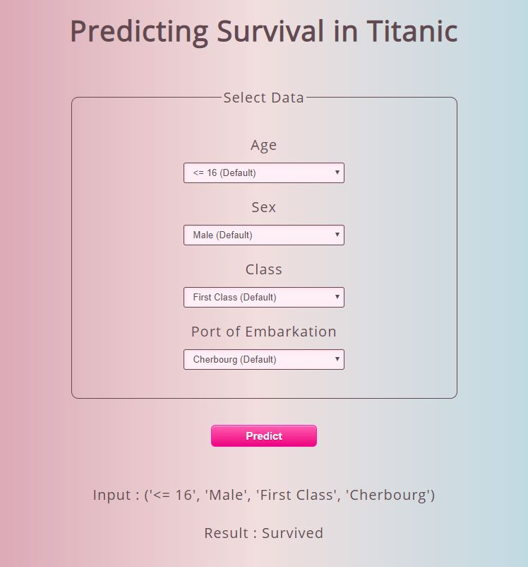

# Predicting Survival in Titanic

An application to predict who survived in Titanic.

<b> Features: </b>
<ul>
  <li>Age</li>
  <li>Sex</li>
  <li>Class</li>
  <li>Port of Embarkation</li>
  <li>Age x Class</li>
</ul>

<b> Model: </b>
Random Forest Classifier
Training Accuracy: 82.5%
Cross-Validation Accuracy: 82.0%
Actual Accuracy: 78.5%

Demo: <a href='https://huiling-titanic.herokuapp.com/'>https://huiling-titanic.herokuapp.com/</a>

